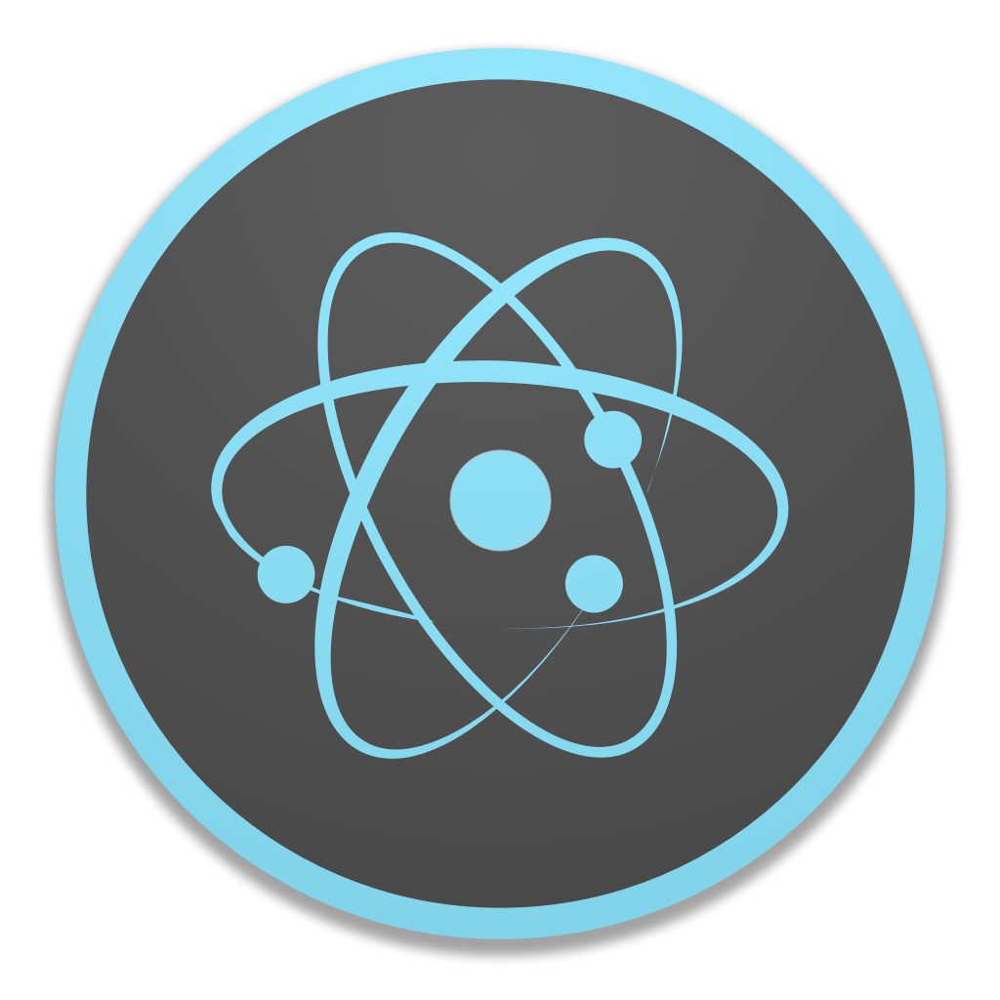

<div align="center">
  <!-- Placeholder Logo -->
  

  <p><em>A sleek and unified desktop launcher for all your games — Steam and beyond.</em></p>

  <!-- Badges -->
  <p>
    
    
    
  </p>
</div>

---

## 🚀 Features

- 🎮 **Steam Integration** – Auto-detect and display all your installed Steam games.
- 🖱️ **One-Click Launch** – Launch any game instantly with a single click.
- ➕ **Add Non-Steam Games** – Expand your library with custom game entries.
- 🗂️ **Unified Launcher** – One interface for all your games, from any platform.

---

## 📸 Demo

<!-- Replace this with a real gif later -->
<p align="center">
  
</p>

---

## 🧰 Tech Stack

- **Electron** – Native desktop shell
- **React** – Frontend UI
- **TypeScript** – Type safety for reliability
- **PouchDB** – Local storage

---

## 📦 Installation

```bash
git clone https://github.com/rettgp/pixeldock.git
cd pixeldock
npm install
npm run start
```
