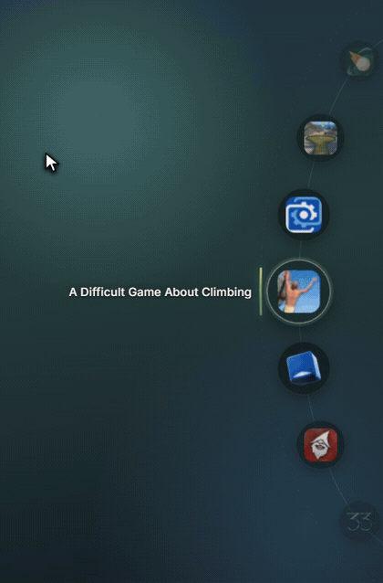
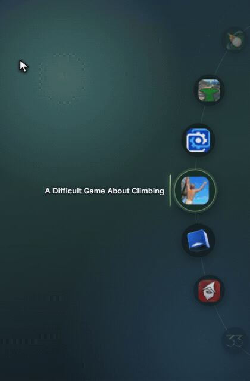
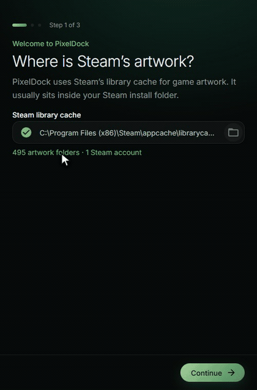
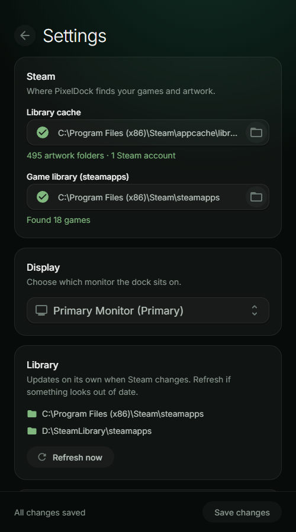

<div align="center">
  <!-- Placeholder Logo -->
  

  <p><em>A sleek and unified desktop launcher for all your games — Steam and beyond.</em></p>

  <!-- Badges -->
  <p>
    
    
    
  </p>
</div>

---

## 🚀 Features

- 🎮 **Steam Integration** – Auto-detect and display all your installed Steam games, across every Steam library folder.
- 🎡 **Game Dial** – A half dial of game icons docked to the screen edge that scrolls endlessly and stays out of your wallpaper's way.
- ✨ **Hover to Preview** – Each icon grows into the game's hero art and logo; one click launches it.
- 🖱️ **One-Click Launch** – Launch any game instantly with a single click.
- ➕ **Non-Steam Games** – Games you add to Steam with "Add a Non-Steam Game" show up automatically, with SteamGridDB/SGDBoop artwork.
- 🔄 **Live Library** – Installs, uninstalls, new shortcuts and new artwork appear without restarting.
- 🗂️ **Unified Launcher** – One interface for all your games, from any platform.

---

## 📸 Demo

<table align="center">
  <tr>
    <td align="center"></td>
    <td align="center"></td>
  </tr>
  <tr>
    <td align="center"><sub><b>Hover to preview</b> · icons bloom into hero art</sub></td>
    <td align="center"><sub><b>Endless dial</b> · smooth, wrap-around scrolling</sub></td>
  </tr>
  <tr>
    <td align="center"></td>
    <td align="center"></td>
  </tr>
  <tr>
    <td align="center"><sub><b>First-run setup</b> · Steam paths detected and validated</sub></td>
    <td align="center"><sub><b>Settings</b> · paths, monitor and library at a glance</sub></td>
  </tr>
</table>

---

## 🧰 Tech Stack

- **Electron** – Native desktop shell
- **React** – Frontend UI
- **TypeScript** – Type safety for reliability
- **PouchDB** – Local storage

---

## 📦 Installation

Download `PixelDock-Setup-<version>.exe` from the
[latest release](https://github.com/rettgp/pixeldock/releases/latest) and run it.

> [!NOTE]
> **Seeing "Windows protected your PC"?** Microsoft Defender SmartScreen shows this
> for apps it hasn't seen many downloads of yet. Click **More info → Run anyway**.
> PixelDock is open source; you can review the code or build it yourself below.

### Build from source

```bash
git clone https://github.com/rettgp/pixeldock.git
cd pixeldock
npm install
npm run start
```

Maintainers: see [docs/RELEASING.md](docs/RELEASING.md) for publishing, code signing and winget.
